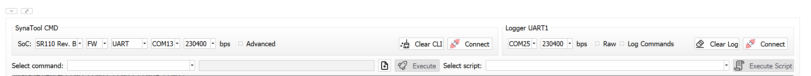
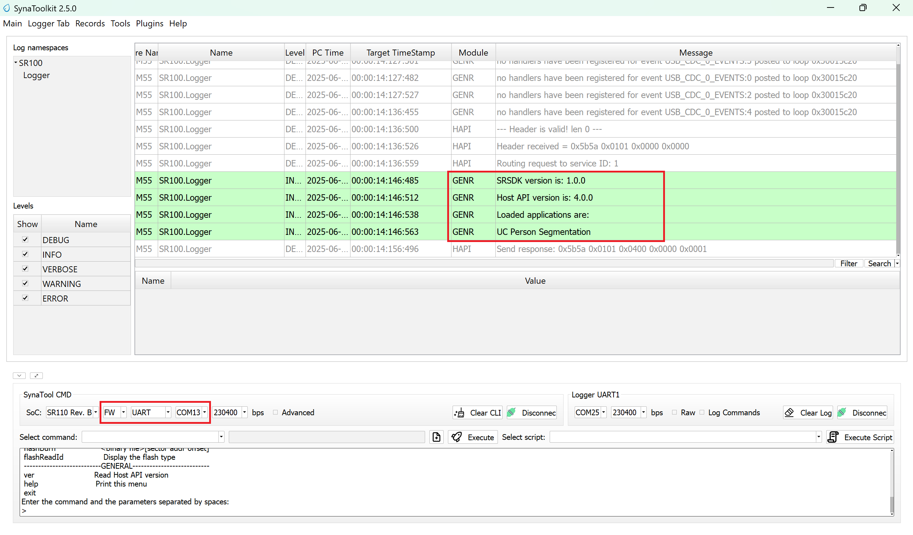
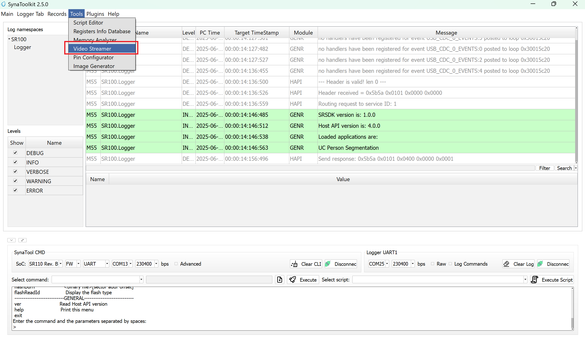
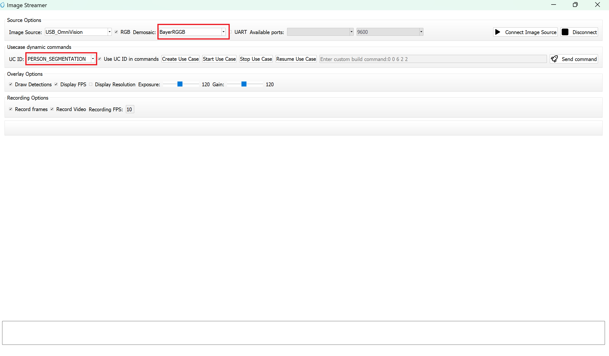
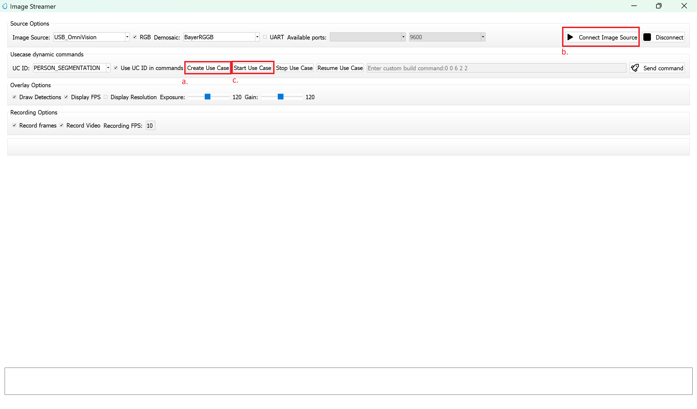
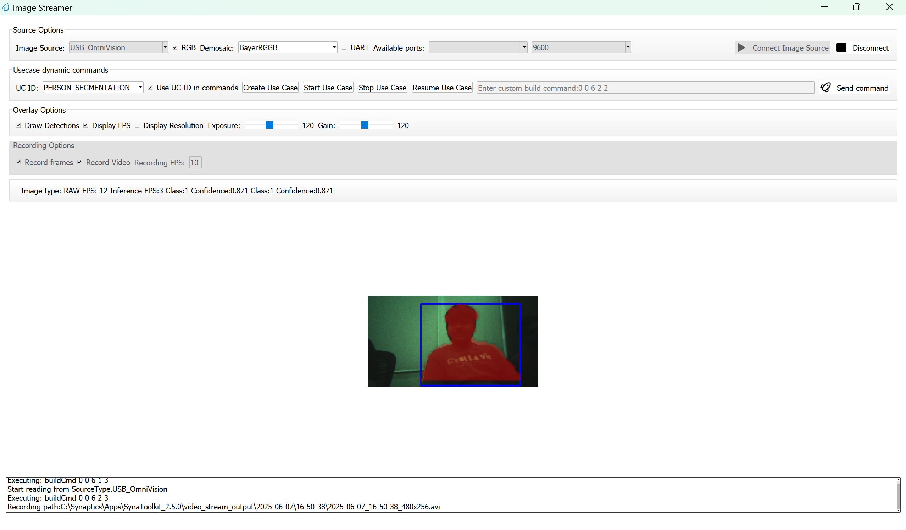

# Person Segmentation ML Application

## Description

The UC Segmentation application is designed to detect and segment persons within the camera's field of view. It generates pixel-wise masks that accurately outline each detected individual, along with corresponding bounding boxes and confidence scores. The output includes segmented regions that represent the exact shape of each person in the image, providing both spatial and confidence-level insights for each detection. This example supports both WQVGA(480x270) and VGA(640x480) resolutions.

## Build Instructions

### Prerequisites
- [GCC/AC6 build environment setup](../developer_guide/build_env.rst)
- [Astra SRSDK VS Code Extension](../developer_guide/SRSDK_VSCode_Extension_Userguide.rst)
- [SynaToolkit](../subject/toolkit/toolkit.rst)

### Configuration and Build Steps

1. **Select Default Configuration**
   ```bash
   make cm55_person_segmentation_defconfig
   ```
   This configuration uses WQVGA resolution by default.

2. **Optional Configuration:**

   >💡Tip: Run `make meuconfig` to modify the configuration via a GUI.

   | Configuration | Menu Navigation | Action |
   |---------------|-----------------|---------|
   | **VGA Resolution** | `COMPONENTS CONFIGURATION → Off Chip Components → Display Resolution` | Change to `VGA(640x480)` |
   | **WQVGA in LP Sense** | `COMPONENTS CONFIGURATION → Drivers` | Enable `MODULE_LP_SENSE_ENABLED` |
   | **Static Image** | `COMPONENTS CONFIGURATION → Off Chip Components` | Disable `MODULE_IMAGE_SENSOR_ENABLED` |

3. **Build the Application**
   The build process will generate the required `.elf` or `.axf` files for deployment.
   ```bash
   make build or make
   ```

## Deployment and Execution

### Setup and Flashing

1. **Open Image Flashing Window**
   Navigate to the Image Flashing Window on Astra SRSDK VS Code Extension.
   For detailed steps on generating and flashing images, refer to the [Astra SRSDK VSCode Extension User Guide](../developer_guide/SRSDK_VSCode_Extension_Userguide.rst).

2. **Connect Device**
   Establish connection between your target device and the host system.
   refer to [Quick Start Guide](../quickstart/Astra_SRSDK_Quick_Start_Guide.rst).

3. **Generate Binary Files**
   - FW Binary generation
      - Navigate to **AXF/ELF TO BIN** → **Bin Conversion** in Astra SRSDK VSCode Extension
      - Load the generated `sr110_cm55_fw.elf` or `sr110_cm55_fw.axf` file
      - Click **Run Image Generator** to create the binary files
   - Model Binary generation (to place the Model in Flash)
      - To generate `.bin` file for TFLite models, please refer to the [Vela compilation guide](Astra_SRSDK_vela_compilation_tflite_model.md).

4. **Flash the Application**
   
   **For WQVGA resolution:**
   - Flash the generated `B0_flash_full_image_GD25LE128_67Mhz_secured.bin` file directly to the device. Note: Model weights is placed in SRAM.
   
   **For VGA resolution:**
   - Flash the pre-generated model binary: `person_segmentation_flash(448x640).bin`. Due to memory constraints, need to burn the Model weights to Flash. 
     - Location: `examples/vision_examples/uc_person_segmentation/models/`
     - Flash address: `0x629000`
     - **Calculation Note:** Flash address is determined by the sum of the `host_image` size and the `image_offset_SDK_image_B_offset` (parameter, which is defined within `NVM_data.json`). It's crucial that the resulting address is aligned to a sector boundary (a multiple of 4096 bytes).This calculated resulting address should then be assigned to the `image_offset_Model_A_offset` macro in your `NVM_data.json` file.
   - Flash the generated `B0_flash_full_image_GD25LE128_67Mhz_secured.bin` file

5. **Device Reset**
   Reset the target device after flashing is complete.

### Note:

The placement of the model (in **SRAM** or **FLASH**) is determined by its memory requirements. Models that exceed the available **SRAM** capacity, considering factors like their weights and the necessary **tensor arena** for inference, will be stored in **FLASH**.

### Running the Application

1. **Connect to Serial Interface**  
   - Connect to the newly enumerated COM port  
   - For logging output, connect to DAP logger port  

   

2. **The example logs will then appear in the logger window.**  

   

3. **Next, navigate to Tools → Video Streamer in SynaToolkit to run the application.**  

   

4. **Video Streamer**  
   - Configure the following settings:  
     - **UC ID**: PERSON_SEGMENTATION
     - **RGB Demosaic**: BayerRGGB  

   

   - Click **Create Usecase**  
   - Connect the image source  
   - Click **Start Usecase** to begin real-time segmentation  

   

5. **After starting the use case, Person segmentation will begin streaming video as shown below.**
   
