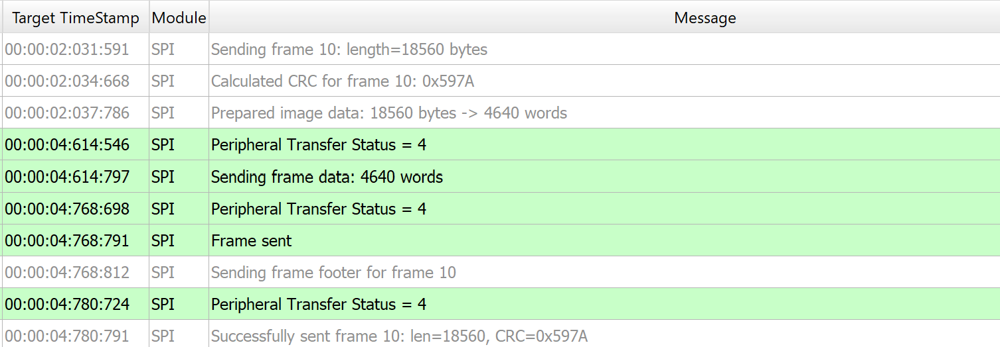

# Doorbell ML Application

## Overview

The **Doorbell sample application** integrates the `UC_JPEG_PREROLL` and `IMAGE_STITCHING` use cases to detect a person within the camera’s field of view and capture high-resolution Full HD (FHD) images upon detection.

### Image Delivery Options

Captured images can be delivered in two ways:

| Delivery Mode         | Description                                                                                   | Tools for Visualization                     |
|-----------------------|-----------------------------------------------------------------------------------------------|---------------------------------------------|
| USB CDC (to Host PC)  | Sends images via USB CDC to a host PC.                                                        | SynaToolkit, VS Code Extension              |
| SPI to Controller     | Sends images over SPI to another Astra Machina Eval Kit acting as a controller; receives frames for logging. | Logger |

---

## Build Instructions

### Prerequisites

- [Astra SRSDK VS Code Extension](../developer_guide/SRSDK_VSCode_Extension_Userguide.rst)
- [SynaToolkit](../subject/toolkit/toolkit.rst)

### Build Options

| Method           | Steps                                                                                           | Notes                                           |
|------------------|-------------------------------------------------------------------------------------------------|-------------------------------------------------|
| VS Code Extension| Import SDK → Build or Clean SDK in “Imported Repos” → select configs (Application, Board, Compiler) → Build | GUI workflow; logs appear in VS Code terminal. |
| Native CLI       | Run `make cm55_doorbell_defconfig` → `make menuconfig` (optional) → `make`                     | Suitable for native builds                     |

### Native Configuration and Build Steps

1. **Select Default Configuration**
   ```bash
   make cm55_doorbell_defconfig
   ```
   This configuration uses CONFIG_WAKEUP_TRIGGER set to 1 (Timer-based wakeup).

2. **Configure WAKEUP_TRIGGER**
   Navigate to: `uc_jpeg_preroll.c` change to CONFIG_WAKEUP_TRIGGER set to 2 for (GPIO-based wakeup)

3. **Build the Application**
   The build process will generate the required `.elf` or `.axf` files for deployment.
   ```bash
   make build or make
   ```

## Deployment and Execution

### Setup and Flashing

1. **Open the Astra SRSDK VSCode Extension and connect to the Debug IC USB port on the Astra Machina Micro Kit.**
   For detailed steps refer to the [Quick Start Kit](../quickstart/Astra_SRSDK_Quick_Start_Guide.rst).

2. **Generate Binary Files**
   - FW Binary generation
      - Navigate to **AXF/ELF TO BIN** → **Bin Conversion** in Astra SRSDK VSCode Extension
      - Load the generated `sr110_cm55_fw.elf` or `sr110_cm55_fw.axf` file
      - Click **Run Image Generator** to create the binary files
      - Refer to [Astra SRSDK VSCode Extension User Guide](../developer_guide/Astra_MCU_SDK_VSCode_Extension_Userguide.rst).
   - Model Binary generation (to place the Model in Flash)
      - To generate `.bin` file for TFLite models, please refer to the [Vela compilation guide](Astra_SRSDK_vela_compilation_tflite_model.md).

3. **Flash the Application**

   To flash the application:

   * Navigate to **IMAGE LOADING** in the Astra SRSDK VSCode Extension.
   * Select **SWD/JTAG** as the service type.
   * Choose the respective image bins and click **Flash Execute**.
   * Flash the pre-generated model binary: `door_bell_flash(384x512).bin`. Due to memory constraints, need to burn the Model weights to Flash.
     - Location: `examples/vision_examples/uc_jpeg_preroll/models/`
     - Flash address: `0x629000`
     - **Calculation Note:** Flash address is determined by the sum of the `host_image` size and the `image_offset_SDK_image_B_offset` (parameter, which is defined within `NVM_data.json`). It's crucial that the resulting address is aligned to a sector boundary (a multiple of 4096 bytes).This calculated resulting address should then be assigned to the `image_offset_Model_A_offset` macro in your `NVM_data.json` file.
   - Flash the generated `B0_flash_full_image_GD25LE128_67Mhz_secured.bin` file.

   Refer to the [Astra SRSDK VSCode Extension User Guide](../developer_guide/Astra_MCU_SDK_VSCode_Extension_Userguide.rst) for detailed instructions on flashing.

### Note:

The placement of the model (in **SRAM** or **FLASH**) is determined by its memory requirements. Models that exceed the available **SRAM** capacity, considering factors like their weights and the necessary **tensor arena** for inference, will be stored in **FLASH**.

## Running the Application

### Options

| Method           | Steps                                                                 |
|------------------|-----------------------------------------------------------------------|
| **SynaToolkit**      | Open Toolkit → Connect USB (SR110 App port) → Press Reset → View logs on DAP port |
| **VS Code Extension**| Open `LOGGER` tab → Select port & baud → Connect                 |

💡 You can find detailed setup and usage instructions in the **Astra SRSDK VSCode Extension User Guide**.

#### Initial Setup

- Press `RSTN` button on `SR110_RDK`.

#### Operation Flow

- On detection → frame is streamed → device enters hibernation.

---

### Wakeup Triggers

| Trigger | Config                     | Behavior                                           |
|---------|----------------------------|----------------------------------------------------|
| Timer   | `CONFIG_WAKEUP_TRIGGER=1`  | Device wakes every 10 seconds.                    |
| GPIO    | `CONFIG_WAKEUP_TRIGGER=2`  | Jumper from GND → UART0 RX after 10s of hibernation. |

## SPI Pre-roll Use Case

### Overview
The SPI Pre-roll feature enables UC_JPEG_PREROLL to capture JPEG pre-roll frames and stream
them to a **controller (receiver)** over **SPI**.

- **Peripheral (Sender)**: The device that's flashed with **UC_JPEG_PREROLL** acts as the **SPI Peripheral device**, that captures frames, packages them with headers/footers, and transmits them via SPI.
- **Controller (Receiver)**: The device that's flashed with **SPI_SAMPLE_APP** acts as the **SPI Controller device**, that requests pre-roll frames, and validates CRC.

This mechanism ensures that when detection is triggered, the system can send pre-roll images that occurred **before** the detection event.

The SPI Pre-roll transfer follows a protocol as described in [SPI Pre-roll Protocol](spi_preroll_protocol.md)

## Configurations

### Peripheral (Sender) Configurations

Run the Doorbell defconfig to apply the default settings for the doorbell use case. Enable SPI module by enabling **MODULE_SPI_ENABLED** and build the image. With the settings, the device will operate as the SPI pre-roll Peripheral (Sender).

```bash
make cm55_doorbell_defconfig
make menuconfig #Enable SPI and LOGGER_IF_UART_0
make
```
**Remember** enable LOGGER_IF_UART_0 before building the peripheral image with **LOGGER_IF_UART_0** in the menuconfig.

### Controller (Receiver) Configurations

Run the SPI Sample App defconfig to apply the default settings for the SPI Sample application.
Enable **SPI_PREROLL_TRANSFER** in `spi_sample_app.c` and **SPI_DOUBLE_BOARD_MODE**
in `spi_sample_app.h` and build the image.
With these settings, the device will operate as the SPI pre-roll Controller (Receiver).

```bash
make cm55_spi_sample_app_defconfig
make
```

## Hardware Setup

The following are the pins that are used for SPI Communication,

### Controller Pins

1. Pin 11 - SPI_MSTR_CLK (GPIO_22)
2. Pin 12 - SPI_MSTR_CS (GPIO_21)
3. Pin 13 - SPI_MSTR_MISO (GPIO_24)
4. Pin 14 - SPI_MSTR_MOSI (GPIO_23)

### Peripheral Pins

1. Pin 7 - SPI_SLV_CLK (GPIO_6)
2. pin 8 - SPI_SLC_CS (GPIO_8)
3. pin 9 - SPI_SLV_MISO (GPIO_7)
4. pin 10 - SPI_SLV_MOSI (GPIO_9)

### Connections

1. Pin 11 (SPI_MSTR_CLK) →  Pin 7 (SPI_SLV_CLK)
2. Pin 12 (SPI_MSTR_CS) →  Pin 8 (SPI_SLV_CS)
3. Pin 13 (SPI_MSTR_MISO) →  Pin 9 (SPI_SLV_MISO)
4. Pin 14 (SPI_MSTR_MOSI) →  Pin 10 (SPI_SLV_MOSI)

**Remember**, The logs will be seen via UART 0. Enable UART 0 log via menuconfig. It is recommended to have the DAP SR110 not powered up because of SPI pin conflict in RDK.

## Connection Images

   
   

## Test Procedure

The test can begin once the images are built, flashed onto the respective devices, and the hardware setup is completed. The pins described above represent the required SPI connections. In addition, the Ground lines of both boards must be connected to ensure a stable link. Failure to do so may result in corrupted or invalid data.

### Peripheral (Sender) Steps

Before flashing the Peripheral image, the model binary must first be loaded at address **0x629000**.
Once the model is loaded, flash the Peripheral image and reset the device.
On reset, the device enters hibernation and capture pre-roll images. Once the device wakes up from hibernation and if detection events are seen, It will initiate the SPI Peripheral Transfer to stream the captured pre-roll images.




### Controller (Receiver) Steps

Flash the Controller image, but reset the controller device only after the peripheral wakes up
from hibernation and begins the peripheral transfer.
This ensures that the peripheral is ready to accept the pre-roll request and related commands
from the controller.

   
   

## Expected Results

Controller initiates the transfer by sending a pre-roll request header. Peripheral responds with the stream header, all pre-roll JPEG frames, and the stream end marker over SPI.
Controller successfully receives and validates each frame, including headers, CRC, and footers. We can confirm successful reception of pre-roll frames with logs.
