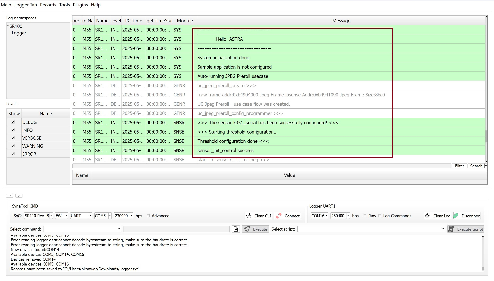
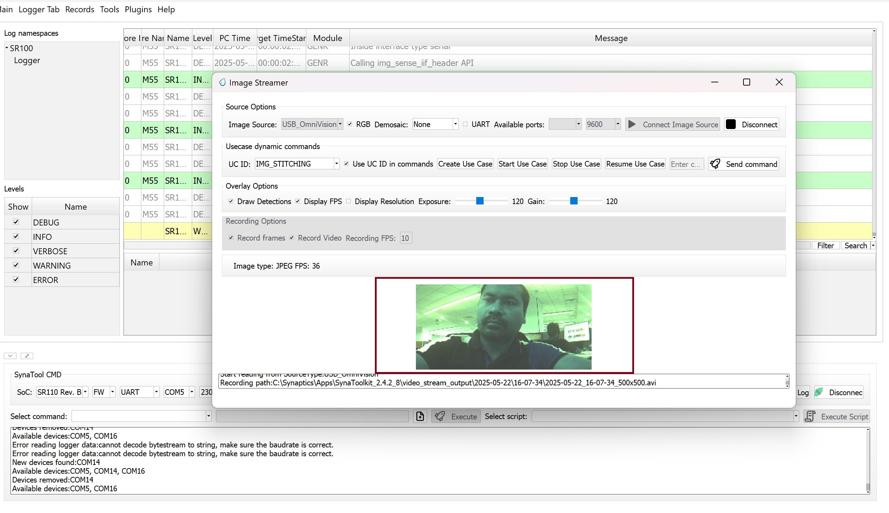
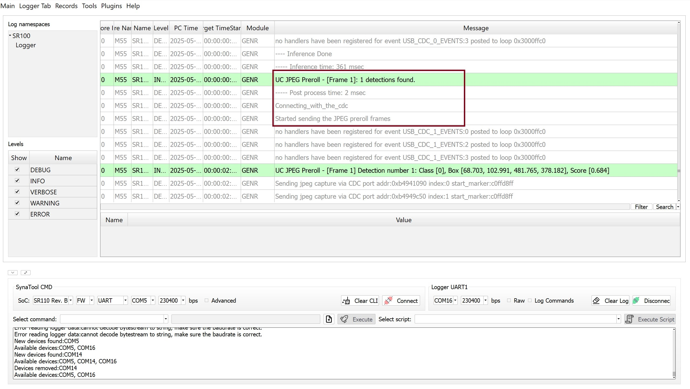

# Serial Camera Doorbell ML Application

## Description

The Serial Camera Doorbell sample application uses the K351 serial camera sensor to capture a 500x500 RAW Bayer image along with a sequence of JPEG preroll images. It is capable of detecting a person within its field of view and, upon detection, automatically sends 9 JPEG preroll images to provide context before the event. To use this application, follow the instructions in the build, run, and results sections. The JPEG preroll images are saved in the overlayed_frames subfolder within the video_stream_output directory of the SynaToolkit folder.

## Build Instructions

### Prerequisites
- [GCC/AC6 build environment setup](../developer_guide/build_env.rst)
- [Astra SRSDK VS Code Extension](../developer_guide/SRSDK_VSCode_Extension_Userguide.rst)
- [SynaToolkit](../subject/toolkit/toolkit.rst)


### Configuration and Build Steps

### Configuration and Build Steps

1. **Select Default Configuration**
   ```bash
   make cm55_serial_camera_door_bell_defconfig
   ```
   This configuration uses CONFIG_WAKEUP_TRIGGER set to 1 (Timer-based wakeup).

2. **Configure WAKEUP_TRIGGER**
   Navigate to: `uc_jpeg_preroll.c` change to CONFIG_WAKEUP_TRIGGER set to 2 for (GPIO-based wakeup)
 
3. **Build the Application**
   The build process will generate the required `.elf` or `.axf` files for deployment.
   ```bash
   make build or make
   ```

## Deployment and Execution

### Setup and Flashing

1. **Open the Astra SRSDK VSCode Extension and connect to the Debug IC USB port on the Astra Machina Micro Kit.**
   For detailed steps refer to the [Quick Start Kit](../quickstart/Astra_SRSDK_Quick_Start_Guide.rst).

2. **Generate Binary Files**
   - FW Binary generation
      - Navigate to **AXF/ELF TO BIN** → **Bin Conversion** in Astra SRSDK VSCode Extension
      - Load the generated `sr110_cm55_fw.elf` or `sr110_cm55_fw.axf` file
      - Click **Run Image Generator** to create the binary files
      - Refer to [Astra SRSDK VSCode Extension User Guide](../developer_guide/SRSDK_VSCode_Extension_Userguide.rst).
   - Model Binary generation (to place the Model in Flash)
      - To generate `.bin` file for TFLite models, please refer to the [Vela compilation guide](Astra_SRSDK_vela_compilation_tflite_model.md).

3. **Flash the Application**

   To flash the application:

   * Navigate to **IMAGE LOADING** in the Astra SRSDK VSCode Extension.
   * Select **SWD/JTAG** as the service type.
   * Choose the respective image bins and click **Flash Execute**.
   * Flash the pre-generated model binary: `door_bell_flash(384x512).bin`. Due to memory constraints, need to burn the Model weights to Flash. 
     - Location: `examples/vision_examples/uc_jpeg_preroll/models/`
     - Flash address: `0x629000`
     - **Calculation Note:** Flash address is determined by the sum of the `host_image` size and the `image_offset_SDK_image_B_offset` (parameter, which is defined within `NVM_data.json`). It's crucial that the resulting address is aligned to a sector boundary (a multiple of 4096 bytes).This calculated resulting address should then be assigned to the `image_offset_Model_A_offset` macro in your `NVM_data.json` file.
   - Flash the generated `B0_flash_full_image_GD25LE128_67Mhz_secured.bin` file.

   Refer to the [Astra SRSDK VSCode Extension User Guide](../developer_guide/SRSDK_VSCode_Extension_Userguide.rst) for detailed instructions on flashing. 

### Note:

The placement of the model (in **SRAM** or **FLASH**) is determined by its memory requirements. Models that exceed the available **SRAM** capacity, considering factors like their weights and the necessary **tensor arena** for inference, will be stored in **FLASH**.

### Running the Application 
 
1. **Open SynaToolkit_2.5.0**

2. **Before running the application, make sure to connect a USB cable to the Application SR110 USB port on the Astra Machina Micro board and then press the reset button**
   - For logging output, connect to DAP logger port 

    
   
   

3. **Initial Setup**
   - After completing the setup, press the RSTN button on the SR110 RDK

4. **Operation Flow**
   - On person detection, the video streamer opens with the captured frame, then the device enters hibernation if one of the following conditions is met:

### Wakeup Triggers

**Timer (CONFIG_WAKEUP_TRIGGER = 1):**
- Device wakes up every 10 seconds
