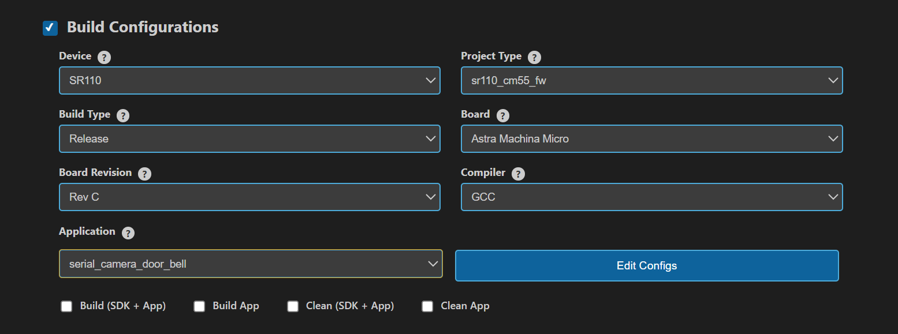
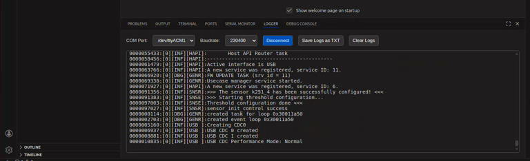
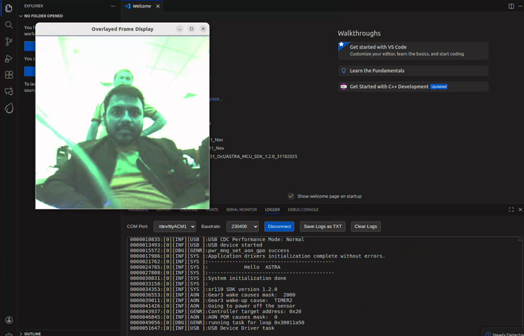
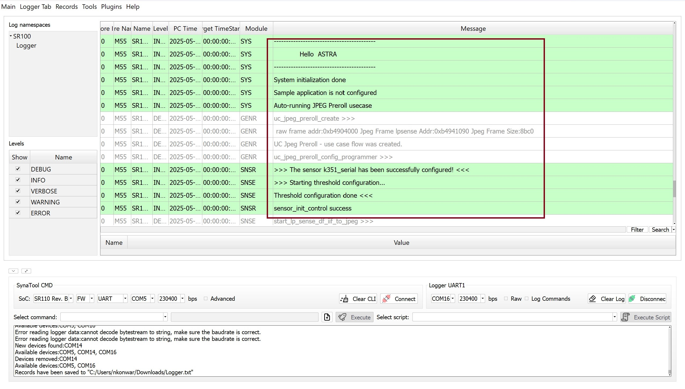
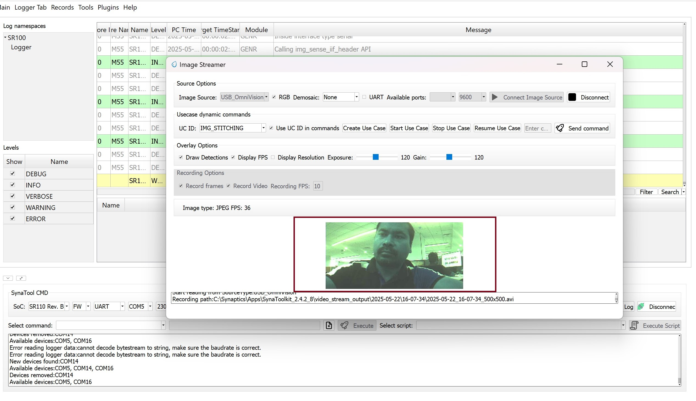
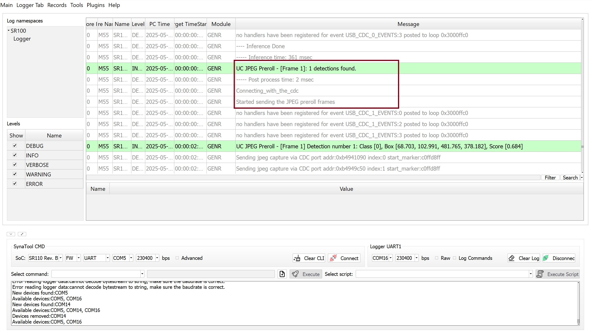

# Serial Camera Doorbell ML Application

## Description

The Serial Camera Doorbell sample application uses the K351 serial camera sensor to capture a 500x500 RAW Bayer image along with a sequence of JPEG preroll images. It is capable of detecting a person within its field of view and, upon detection, automatically sends 9 JPEG preroll images to provide context before the event. To use this application, follow the instructions in the build, run, and results sections. The JPEG preroll images are saved in the overlayed_frames subfolder within the video_stream_output directory.`Example: "C:\Users\<username>\video_stream_output" or "/home/User/video_stream_output"`

## Build Instructions

### Prerequisites
- [GCC/AC6 build environment setup](../developer_guide/build_env.rst)
- [Astra MCU SDK VS Code Extension installed and configured](../developer_guide/Astra_MCU_SDK_VSCode_Extension_Userguide.rst)

### Configuration and Build Steps

**Note:** **Configure WAKEUP_TRIGGER**
   Navigate to: `uc_jpeg_preroll.c` change to CONFIG_WAKEUP_TRIGGER set to 2 for (GPIO-based wakeup)

### 1. Using Astra MCU SDK VS Code extension

   - Navigate to **IMPORTED REPOS** → **Build and Deploy** in the Astra MCU SDK VS Code Extension.
   - Select the **Build Configurations** checkbox, then select the necessary options.
   - Select **serial_camera_door_bell** in the **Application** dropdown. This will apply the defconfig.
   - Select the appropriate build and clean options from the checkboxes. Then click **Run**. This will build the SDK generating the required `.elf` or `.axf` files for deployment using the installed package.

   For detailed steps refer to the [Astra MCU SDK VS Code Extension Userguide](../developer_guide/Astra_MCU_SDK_VSCode_Extension_Userguide.rst).

   

### 2. Native build in the terminal

2. **Select Default Configuration and Build SDK + Example**
   This will apply the defconfig, then build and install the SDK package, generating the required `.elf` or `.axf` files for deployment.
   ```bash
   make cm55_serial_camera_door_bell_defconfig BOARD=SR110_RDK BUILD=SRSDK
   ```
   This configuration uses CONFIG_WAKEUP_TRIGGER set to 1 (Timer-based wakeup).

3. **Rebuild the Application using pre-built package**
   The build process will produce the necessary `.elf` or `.axf` files for deployment with the installed package.
   ```bash
   make cm55_serial_camera_door_bell_defconfig BOARD=SR110_RDK or make
   ```

## Deployment and Execution

### Setup and Flashing

1. **Open the Astra MCU SDK VSCode Extension and connect to the Debug IC USB port on the Astra Machina Micro Kit.**
   For detailed steps refer to the [Astra MCU SDK User Guide](../quickstart/Astra_MCU_SDK_User_Guide.md).

2. **Generate Binary Files**
   - FW Binary generation
      - Navigate to **IMPORTED REPOS** → **Build and Deploy** in Astra MCU SDK VSCode Extension.
      - Select the **Image Conversion** option, browse and select the required .axf or .elf file. If the usecase is built using the VS Code extension, the file path will be automatically populated.

      
      - Click **Run** to create the binary files.
      - Refer to [Astra MCU SDK VSCode Extension User Guide](../developer_guide/Astra_MCU_SDK_VSCode_Extension_Userguide.rst) for more detailed instructions.
   - Model Binary generation (to place the Model in Flash)
      - To generate `.bin` file for TFLite models, please refer to the [Vela compilation guide](Astra_MCU_SDK_vela_compilation_tflite_model.md).

3. **Flash the Application**

   - To flash the application:
      * Select the **Image Flashing** option in the **Build and Deploy** view in the Astra MCU SDK VSCode Extension.
      * Select **SWD/JTAG** as the Interface.
      * Choose the respective image bins and click **Run**.

   * Flash the pre-generated model binary: `door_bell_flash(384x512).bin`. Due to memory constraints, need to burn the Model weights to Flash.
     - Location: `examples/SR110_RDK/vision_examples/uc_jpeg_preroll/models/`
     - Flash address: `0x629000`
     - **Calculation Note:**
         The flash address is determined by adding the `host_image` size and the `image_offset_SDK_image_B_offset` parameter (defined in `NVM_data.json`).
         Ensure the resulting address is aligned to a sector boundary (a multiple of 4096 bytes).
         This calculated address should then be assigned to the `image_offset_Model_A_offset` macro in your `NVM_data.json` file.

     

      > Note: By default, flashing a binary performs a sector erase based on the binary size. To erase the entire flash memory, enable the **Full Flash Erase** checkbox. When this option is selected along with a binary file, the tool first performs a full flash erase before flashing the binary. If the checkbox is selected without specifying a binary, only a full flash erase operation will be executed.

   Refer to the [Astra MCU SDK VSCode Extension User Guide](../developer_guide/Astra_MCU_SDK_VSCode_Extension_Userguide.rst) for detailed instructions on flashing. 

### Note:

The placement of the model (in **SRAM** or **FLASH**) is determined by its memory requirements. Models that exceed the available **SRAM** capacity, considering factors like their weights and the necessary **tensor arena** for inference, will be stored in **FLASH**.

### Running the Application using VS Code extension

1. **Before running the application, make sure to connect a USB cable to the Application SR110 USB port on the Astra Machina Micro board and then press the reset button**
   - For logging output, click on **LOGGER** and connect to the DAP logger port.

   

   
2. **Initial Setup**
   - After completing the setup, press the RSTN button on the SR110 RDK

> **Note:**
> The JPEG preroll images are saved in the **`overlayed_frames`** subfolder located inside the **`video_stream_output`** directory.
>
> **Example paths:**
> `C:\Users\<username>\video_stream_output`
> **or**
> `/home/User/video_stream_output`
### Running the Application using SynaToolkit

1. **Open SynaToolkit_2.6.0**

2. **Before running the application, make sure to connect a USB cable to the Application SR110 USB port on the Astra Machina Micro board and then press the reset button**
   - For logging output, connect to DAP logger port

   
   
   

3. **Initial Setup**
   - After completing the setup, press the RSTN button on the SR110 RDK

> **Note:**
> The JPEG preroll images are saved in the **`overlayed_frames`** subfolder within the **`video_stream_output`** directory of the **SynaToolkit** folder.
> **Example paths:**
> `C:\Synaptics\Apps\SynaToolkit_2.6.0\video_stream_output`

4. **Operation Flow**
   - On person detection, the video streamer opens with the captured frame, then the device enters hibernation if one of the following conditions is met:
### Wakeup Triggers

**Timer (CONFIG_WAKEUP_TRIGGER = 1):**
- Device wakes up every 10 seconds
